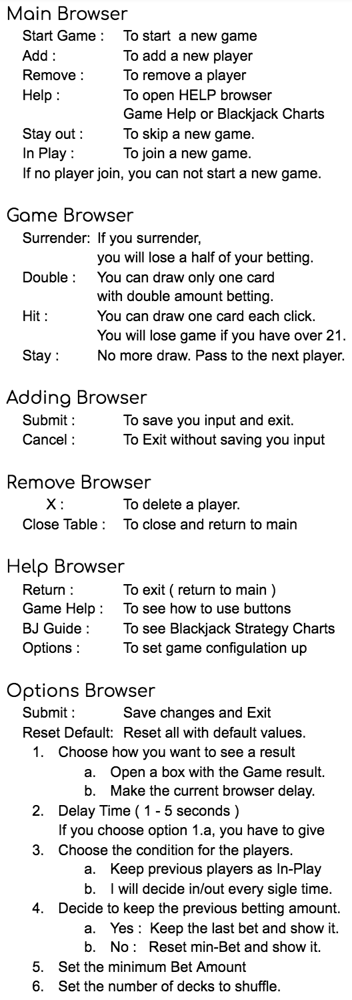

# Blackjack

This project was generated with JavaScript, HTML, and CSS.
Babel was used as a Transpiler and Webpack was use as a module bundler

## Clone, Install, build and start
- open Terminal
- $git clone https://github.com/Hogusong/Blackjack.git
- $cd Blackjack
- npm install
- npm run build
- npm start

## Deploy

http://blackjack-split.s3-website-us-east-1.amazonaws.com

## Help to play

